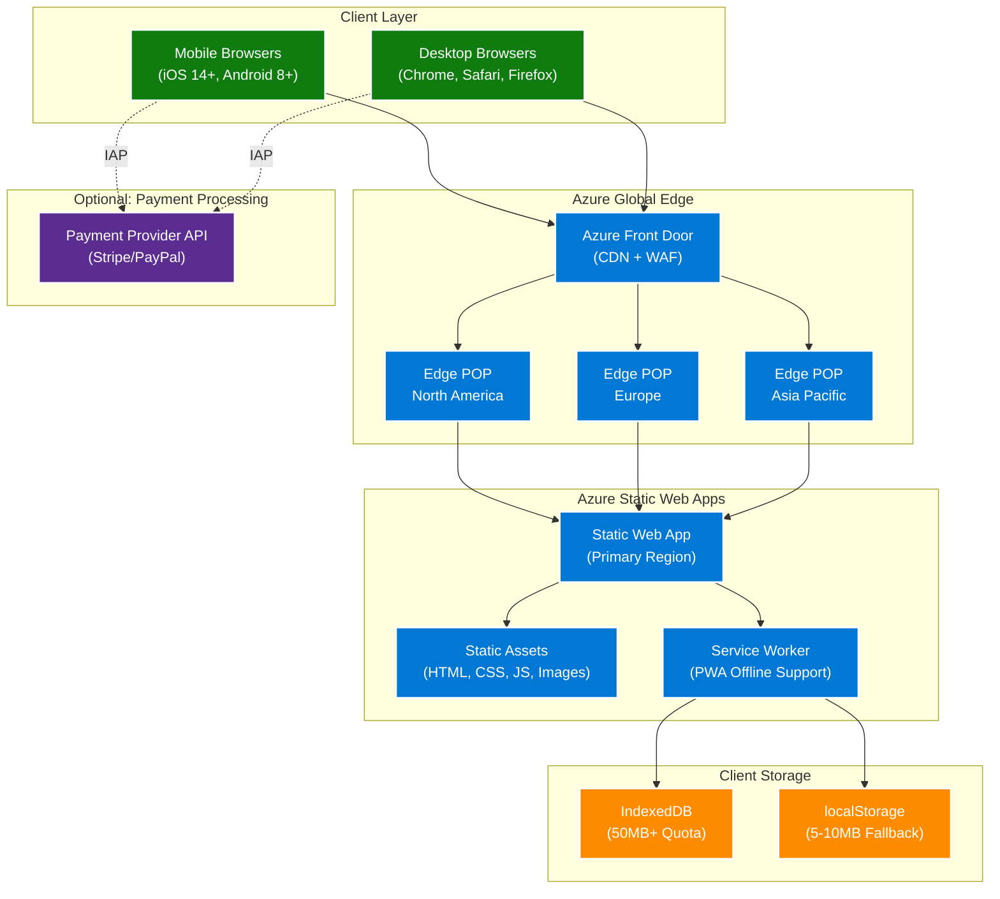
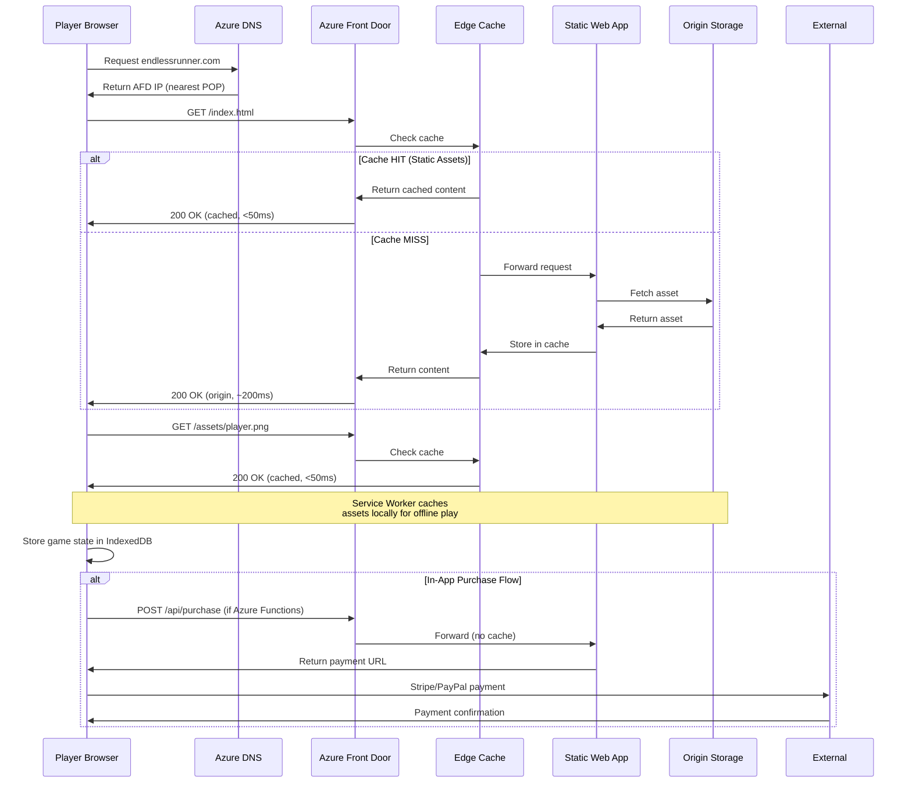
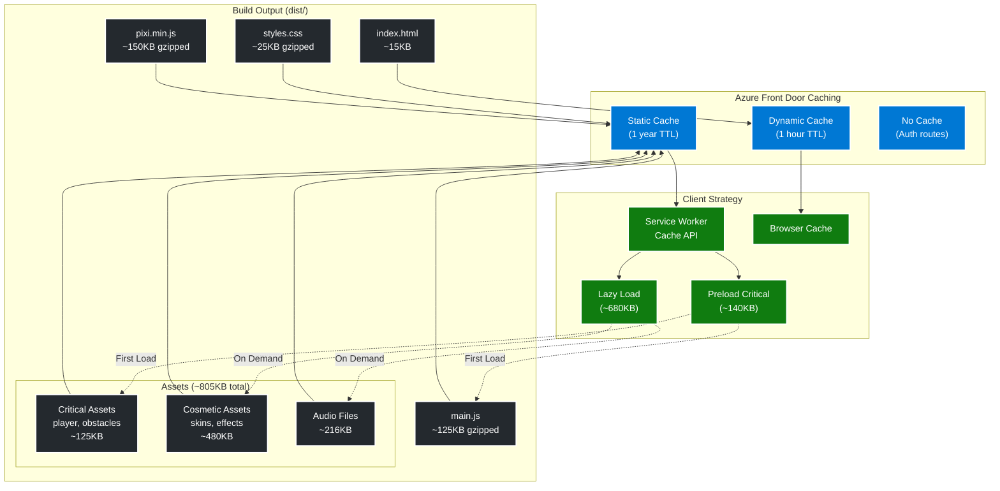
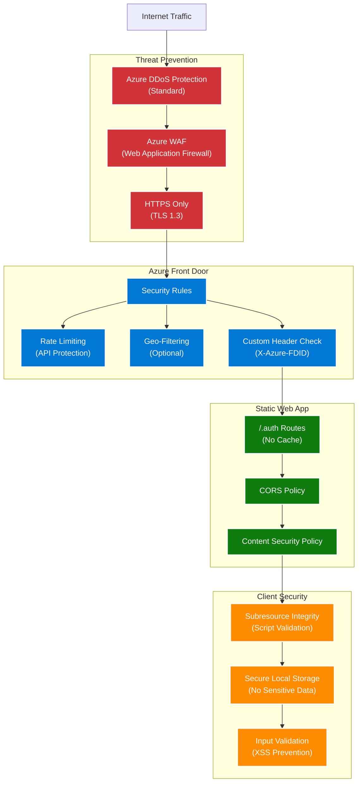
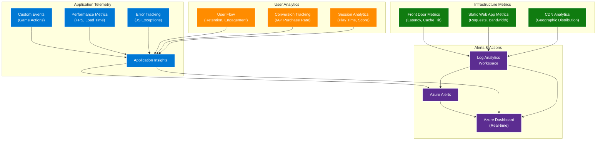
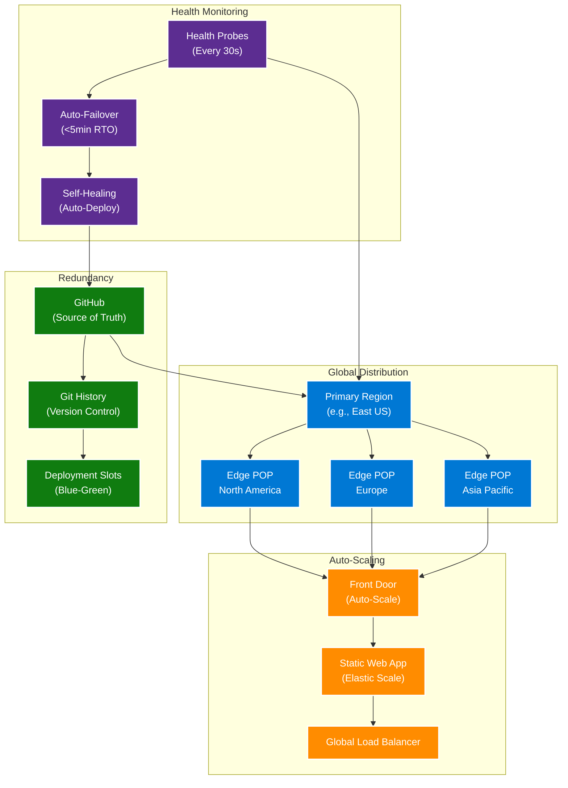

# Azure Deployment Architecture

## Overview

The EndlessRunner game is deployed as a Progressive Web App (PWA) on Azure using Azure Static Web Apps with Azure Front Door CDN for global distribution and optimal performance.

## Architecture Diagrams

### 1. High-Level Azure Architecture



### 2. Deployment Pipeline

```mermaid
graph LR
    subgraph "Development"
        Dev["Developer<br/>Push Code"]
        Git["GitHub Repository<br/>(main branch)"]
    end
    
    subgraph "Build Pipeline"
        Trigger["GitHub Actions<br/>Workflow Trigger"]
        Install["npm install<br/>(Dependencies)"]
        Test["npm test<br/>(Vitest + Playwright)"]
        Build["npm run build<br/>(Vite Bundle)"]
        Optimize["Asset Optimization<br/>(Gzip/Brotli)"]
    end
    
    subgraph "Quality Gates"
        PerfTest["Performance Tests<br/>60 FPS, <2s load"]
        BundleSize["Bundle Size Check<br/><325KB gzipped"]
        Coverage["Code Coverage<br/>(80% target)"]
    end
    
    subgraph "Azure Deployment"
        SWA_CLI["SWA CLI Deploy<br/>(--env production)"]
        SWA_Deploy["Static Web App<br/>Deployment"]
        AFD_Cache["Front Door<br/>Cache Purge"]
    end
    
    subgraph "Verification"
        HealthCheck["Health Check<br/>(Smoke Tests)"]
        Monitor["Azure Monitor<br/>(Application Insights)"]
    end
    
    Dev --> Git
    Git --> Trigger
    Trigger --> Install
    Install --> Test
    Test --> Build
    Build --> Optimize
    
    Optimize --> PerfTest
    Optimize --> BundleSize
    Optimize --> Coverage
    
    PerfTest -->|Pass| SWA_CLI
    BundleSize -->|Pass| SWA_CLI
    Coverage -->|Pass| SWA_CLI
    
    SWA_CLI --> SWA_Deploy
    SWA_Deploy --> AFD_Cache
    AFD_Cache --> HealthCheck
    HealthCheck --> Monitor
    
    PerfTest -.->|Fail| Dev
    BundleSize -.->|Fail| Dev
    Coverage -.->|Fail| Dev
    
    classDef dev fill:#24292e,stroke:#fff,stroke-width:2px,color:#fff
    classDef build fill:#2188ff,stroke:#fff,stroke-width:2px,color:#fff
    classDef test fill:#dbab09,stroke:#000,stroke-width:2px,color:#000
    classDef azure fill:#0078D4,stroke:#fff,stroke-width:2px,color:#fff
    classDef monitor fill:#107C10,stroke:#fff,stroke-width:2px,color:#fff
    
    class Dev,Git dev
    class Trigger,Install,Test,Build,Optimize build
    class PerfTest,BundleSize,Coverage test
    class SWA_CLI,SWA_Deploy,AFD_Cache azure
    class HealthCheck,Monitor monitor
```



### 3. Content Delivery Network (CDN) Flow



### 4. Asset Distribution Strategy



### 5. Security Architecture



### 6. Monitoring & Observability



### 7. Disaster Recovery & Scaling



## Azure Services Used

### Core Services

| Service | Purpose | Configuration |
|---------|---------|---------------|
| **Azure Static Web Apps** | Host PWA application | Standard tier, primary region selection |
| **Azure Front Door** | Global CDN and WAF | Standard tier, multiple POPs, compression enabled |
| **Azure DNS** | Domain management | Custom domain with apex and www records |
| **Application Insights** | Telemetry and monitoring | Standard workspace, custom events enabled |

### Optional Services

| Service | Purpose | When to Use |
|---------|---------|-------------|
| **Azure Functions** | Serverless API backend | If server-side validation needed for IAP |
| **Azure Key Vault** | Secret management | Store payment provider API keys securely |
| **Azure CDN** | Additional caching | If Front Door not sufficient |
| **Azure Monitor** | Advanced monitoring | Production environment alerting |

## Performance Targets

| Metric | Target | Azure Configuration |
|--------|--------|---------------------|
| **First Contentful Paint** | <1.0s | Front Door compression, edge caching |
| **Time to Interactive** | <2.0s | Asset optimization, preload critical resources |
| **Cache Hit Ratio** | >90% | 1-year TTL for static assets |
| **Global Latency** | <100ms | Multi-region POPs, geo-distribution |
| **Uptime** | 99.95% | SLA with Standard tier Static Web Apps |
| **Bandwidth Cost** | <$50/month | Aggressive caching, compression |

## Cost Estimation (Monthly)

| Service | Tier | Estimated Cost | Notes |
|---------|------|----------------|-------|
| Azure Static Web Apps | Standard | $9.00 | 100GB bandwidth included |
| Azure Front Door | Standard | $35.00 | CDN, WAF, compression |
| Application Insights | Pay-as-you-go | $5.00 | ~5GB data ingestion |
| Azure DNS | Standard | $1.50 | Custom domain |
| **Total Estimated** | | **~$50.50/month** | For ~10K monthly active users |

**Scaling**: 
- At 100K MAU: ~$150-200/month
- At 1M MAU: ~$500-750/month (primarily bandwidth costs)

## Deployment Steps

See [Azure Deployment Guide](./azure-deployment-guide.md) for detailed step-by-step instructions.

**Quick Start:**

```powershell
# Install SWA CLI
npm install -g @azure/static-web-apps-cli

# Initialize project
npx swa init --yes

# Build application
npm run build

# Deploy to production
npx swa deploy --env production
```

## Next Steps

1. ✅ Review architecture diagrams with stakeholders
2. ⏳ Create Azure resources (see [Azure Deployment Guide](./azure-deployment-guide.md))
3. ⏳ Configure GitHub Actions pipeline
4. ⏳ Set up Application Insights monitoring
5. ⏳ Configure custom domain and SSL
6. ⏳ Enable Azure Front Door WAF policies
7. ⏳ Configure performance alerts

## References

- [Azure Static Web Apps Documentation](https://learn.microsoft.com/en-us/azure/static-web-apps/)
- [Azure Front Door Best Practices](https://learn.microsoft.com/en-us/azure/frontdoor/front-door-overview)
- [Application Insights for JavaScript](https://learn.microsoft.com/en-us/azure/azure-monitor/app/javascript)
- [Progressive Web Apps on Azure](https://learn.microsoft.com/en-us/azure/static-web-apps/deploy-nextjs-hybrid)
